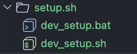
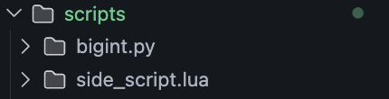
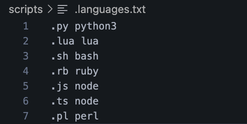

<h1 style="display: flex; align-items: center; margin: 20px 0;">
  
  
  <span style="font-size: 42px; line-height: 1.2; font-weight: bold; color: inherit;">
    SCRIPTS UTILIZATION<br>IN lib-dnml
  </span>
</h1>

### Scripts are extremely useful components of lib-dnml, enhancing the development workflow with both speed, elegance, and certainty. However, there a quite a few ground rules when it comes to the leverage of scripts in [/scripts](/scripts/)

- For the best development experience, please run the Shell script [dev_setup.sh](/scripts/setup.sh/dev_setup.sh) or Batch script [dev_setup.bat](/scripts/setup.sh/dev_setup.bat) to download both "essential" (but not fully needed) dependencies (CMake, Ninja, Rust + Cargo) and also Quality of Life ones (Python, Lua, etc) for the best and msot integrated development experience if you're on a typical, modern desktop environment



- However, it is actually fully possible to develop and maintain lib-dnml with only a C compiler + libc. Despite certain tests and compilation components utilize CMake and Rust + Cargo for a heightened development experience, it is entirely possible to compile using just compiler commands or platform-native Build files (eg: Makefiles on Linux) and run C-native alternatives. Despite such barebone experience, there are, of course, limitations regarding cross-platform compability, maintenance and debugging issues, and execution speed.

- Quality of Life scripts must be seperated into different directories with different suffixes representing the sole language that the scripts inside will be written in (eg: bigInt.py ---> written in Python, side_script.lua ----> written in Lua) for compatibility with the root directory program [`script_launcher.lua`](/scripts/script_launcher.lua). It is also highly advised that scripts are organized based on functionality and operation type



- The main scripting language for lib-dnml is primarily Python (for its robust integrated library, high scripting velocity, and integrated bigInt and bigFloat arithmetic) and Lua (light, robust, highly compatible with C). However, other scripting languages might be permitted as well depending on the user's second-hand expertise (Ruby, JavaScript with Node.JS, Perl, etc).

- Furthermore, the scripting language that have the intention to be managed by [`script_launcher.lua`](/scripts/script_launcher.lua) MUST be interpreted. This is to prevent the pollution of multiple [`script_launcher.lua`](/scripts/script_launcher.lua) simple and fast without handling compilation --> execution like in a traditional compiled-langauge

- With the introduction of any new scripting language into the stack, it is recommended for addition of the language's source file suffix and the engine in which it would be intrepreted/JIT-compiled in inside the file ```.languages.txt``` in the root of [```/script```](/scripts/) for the TUI execution of scripts via the central executor [`script_launcher.lua`](/scripts/script_launcher.lua). However, it is not fully mandatory for developers to adhere to the usage of [`script_launcher.lua`](/scripts/script_launcher.lua) for executing scripts, as straight execution of such scripts in their respective directory is completely acceptable.



However, the usage of [`script_launcher.lua`](/scripts/script_launcher.lua) is entirely optional, and it is always permitted for the execution of script right inside their own subdirectory inside `scripts`, and the organization rules are for ease-of organization and utilization for both [`script_launcher.lua`](/scripts/script_launcher.lua) and normal script execution.